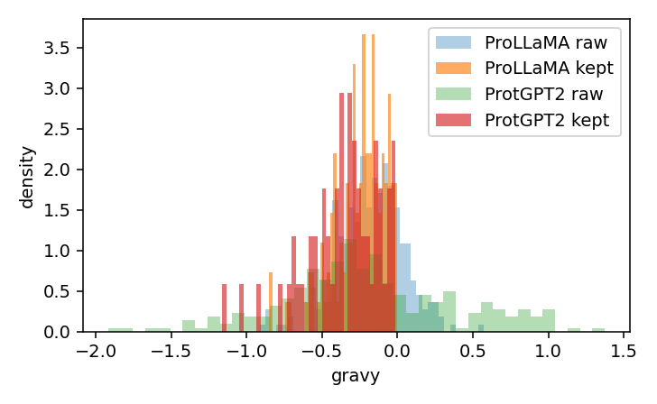

# Mini-EPGF: Evaluating Generative Protein Models via Structured Filtering and Folding Analysis

This repository contains the **extension project** accompanying the M4NLP Seminar Report  
based on the paper:

> **ProLLaMA: A Multi-Stage Instruction-Tuned Protein Language Model**  
> *Liuzhenghao Lv¹, Zongying Lin¹, Hao Li¹², Yuyang Liu¹, Jiaxi Cui¹,  
> Calvin Yu-Chian Chen¹, Li Yuan¹²\*, Yonghong Tian¹²\**  
> ¹Peking University, China ²Peng Cheng Laboratory, China (2024)

---

##  Overview

This project implements a **seven-stage evaluation pipeline** to compare instruction tuned and autoregressive protein language models — **ProLLaMA** and **ProtGPT2** — on their ability to generate biologically meaningful, structurally stable sequences.

The proposed **Mini-EPGF framework** (short for *Mini Evaluative Protein Generation Filter*) integrates interpretable physicochemical descriptors, filtering rules, and structural validation through **ESMFold**.  
It aims to bridge **language-model evaluation methods from NLP** with **bioinformatics-style protein assessment**.

---

## Project Structure

```
mini_epgf/
│
├── data/                      # Raw and filtered FASTA files (ProLLaMA & ProtGPT2)
├── results/                   # Output metrics, merged CSVs, plots, and tables
│   ├── plots/                 # Stage 3–7 plots (instability, GRAVY, pLDDT, ECDF, etc.)
│   └── metrics_*.csv          # Intrinsic and merged statistics
│
├── 01_generate_subset.py      # Sampling + prompt-based generation
├── 02_metrics.py              # Physicochemical metric computation
├── 03_filter_compare.py       # Mini-EPGF filtering and visualization
├── 04_select_subset.py        # Balanced subset selection
├── 05_fold_submit.py          # ESMFold submission (via ESM Atlas API)
├── 06_merge_plddt_and_corr.py # Merge physicochemical + structure data
├── 07_analyze_subset.py       # Summary statistics and final visualizations
│
└── README.md                  # (This file)
```

---

## Installation

```bash

# Create a virtual environment
conda create -n mini_epgf python=3.10
conda activate mini_epgf

# Install dependencies
pip install -r requirements.txt
```

**Dependencies:**
- `pandas`, `numpy`, `matplotlib`, `tqdm`
- `biopython`
- `scipy`
- `requests` (for ESMFold API submission)

---

## Running the Pipeline

Each stage can be executed in sequence:

```bash
python 01_generate_subset.py
python 02_metrics.py
python 03_filter_compare.py
python 04_select_subset.py
python 05_fold_submit.py
python 06_merge_plddt_and_corr.py
python 07_analyze_subset.py
```

Results are saved in the `results/` directory and include:
- `metrics_raw.csv` – per-sequence physicochemical properties  
- `merged_metrics_plddt.csv` – unified dataset with ESMFold outputs  
- `plots/` – distribution, scatter, and ECDF visualizations

---

## Key Findings

- **ProLLaMA** generated **42.8% biophysically valid sequences**, compared to **22.1% for ProtGPT2**.  
- Mean predicted folding confidence (**pLDDT**) was higher for ProLLaMA (61.8) than ProtGPT2 (55.3).  
- Instruction-tuned training yielded **more stable and hydrophilic** sequences with tighter GRAVY and instability distributions.  
- The Mini-EPGF filter effectively distinguishes plausible protein-like generations using interpretable metrics.

---

## Example Visualizations

| Metric | Visualization | Insight |
|:-------|:--------------|:--------|
| Instability |  | ProLLaMA sequences are more stable |
| GRAVY |  | Both models produce hydrophilic proteins |
| pLDDT (ECDF) |  | ProLLaMA curve shows right-shift (higher confidence) |

---

## Interpretation

While **ProLLaMA** exhibits better average foldability and regularity,  
the unexpected observation that some “rejected” sequences still fold well  
suggests that **linguistic quality and structural confidence are not perfectly aligned** —  
an important consideration for future multi-objective fine-tuning.

---

## Citation


```bibtex
@article{lv2024prollama,
  title={ProLLaMA: A Multi-Stage Instruction-Tuned Protein Language Model},
  author={Lv, Liuzhenghao and Lin, Zongying and Li, Hao and Liu, Yuyang and Cui, Jiaxi and Chen, Calvin Yu-Chian and Yuan, Li and Tian, Yonghong},
  journal={arXiv preprint arXiv:2406.08850},
  year={2024}
}


```

---

## Author

**Karan Rajshekar**  
Matrikelnummer: 7062715  
Machine Learning for NLP — Saarland University  

---


